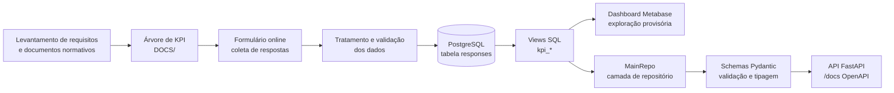

# Tá Na Mesa — Pipeline de Monitoramento da Política Pública (PB)

Pipeline de dados para monitorar a operacionalização do programa "Tá Na Mesa", política pública estadual de segurança alimentar que atende a todo o estado da Paraíba, desde a coleta de respostas de beneficiários até a disponibilização de indicadores (KPIs) via API.

## Sumário

- [Contexto e objetivo](#contexto-e-objetivo)
- [Visão geral da arquitetura / pipeline](#visão-geral-da-arquitetura--pipeline)
- [Estrutura de pastas](#estrutura-de-pastas)
- [Árvore de KPI](#árvore-de-kpi)
- [Stack tecnológica](#stack-tecnológica)
- [Como rodar o projeto localmente](#como-rodar-o-projeto-localmente)
- [Documentação da API](#documentação-da-api)
- [Dashboard (Metabase)](#dashboard-metabase)
- [Dados](#dados)
- [Equipe e governança](#equipe-e-governança)
- [Roadmap / próximos passos](#roadmap--próximos-passos)
- [Licença e contato](#licença-e-contato)

## Contexto e objetivo

O programa Tá Na Mesa oferece refeições subsidiadas a beneficiários em situação de vulnerabilidade alimentar em restaurantes credenciados em todo o estado da Paraíba. Este pipeline existe para responder, com dados, se a política está sendo operacionalizada como planejado: se o programa atinge o público-alvo correto, se o acesso aos restaurantes é equânime, se a execução operacional segue os padrões definidos em edital, se a qualidade das refeições é adequada e se há participação efetiva dos beneficiários na governança do programa.

O programa atende mais de 100 cidades e serve mais de 800.000 refeições mensalmente. É de enorme impacto e seu correto funcionamento é extremamente importante.

**O público do pipeline é primariamente:**

- **Gestores da política pública**, que precisam acompanhar indicadores de desempenho para tomada de decisão.
- **Equipe interdisciplinar** (nutricionistas e assistentes sociais), que validam hipóteses sobre a operacionalização do programa.
- **Beneficiários**, de forma indireta, como público impactado pelas melhorias identificadas a partir do monitoramento.

O ponto de partida analítico foi o levantamento de hipóteses sobre o funcionamento do programa — organizadas em seis eixos (Perfil dos beneficiários, Acesso e Equidade, Execução Operacional, Qualidade da Refeição, Participação e Governança, Legitimidade Social do Programa) — que orientaram tanto o desenho do formulário de coleta quanto a Árvore de KPI usada para validar ou refutar essas hipóteses.

Uma série de reuniões de alinhamento foram executadas ao longo de 3 meses de planejamento, onde indicadores e insights potencialmente relevantes, bem como a forma ideal de obtê-los, foram discutidos.

## Visão geral da arquitetura / pipeline

O pipeline segue seis etapas, do levantamento de requisitos até a disponibilização final dos dados:

1. **Levantamento de requisitos e contexto** — reuniões com gerência e equipe interdisciplinar (nutricionistas e assistentes sociais) e análise de documentos normativos, incluindo o edital de credenciamento dos restaurantes participantes.
2. **Modelagem analítica (Árvore de KPI)** — estruturação hierárquica das hipóteses e dos indicadores que as testam, documentada em `DOCS/` (ver seção [Árvore de KPI](#árvore-de-kpi)).
3. **Coleta de dados** — formulário online disponibilizado via QR-Code respondido por beneficiários em todo o território da Paraíba, com 41 perguntas cobrindo perfil socioeconômico, frequência de acesso, qualidade da refeição, infraestrutura do restaurante e satisfação em relação ao programa.
4. **Tratamento e persistência** — limpeza, padronização e validação das respostas, persistidas em banco **PostgreSQL**.
5. **Disponibilização intermediária (Metabase)** — dashboard exploratório provisório para verificação dos dados antes da disponibilização definitiva.
6. **Disponibilização final (API)** — camada de acesso tipada construída com **FastAPI**, que expõe os KPIs calculados via *views* SQL, através de uma camada de repositório, schemas Pydantic, uma camada service e suas rotas.

## Estrutura de pastas

## Árvore de KPI

A Árvore de KPI estrutura hierarquicamente as hipóteses sobre a operacionalização do programa e os indicadores que as testam. O nó raiz é "Desempenho do programa", que se ramifica em seis eixos principais: Perfil dos beneficiários, Acesso e Equidade, Execução Operacional, Qualidade da Refeição, Participação e Governança, e Legitimidade Social do Programa. Cada eixo agrupa hipóteses, e cada hipótese é testada por um ou mais KPIs (numerados de KPI 1 a KPI 32), cada um com nome, fórmula de cálculo (referenciando as perguntas do formulário, ex. Q5, Q6, Q11) e o sentido de leitura do indicador (se um valor maior ou menor representa melhor desempenho do programa).

Os indicadores foram refinados ao decorrer das reuniões interdisciplinares e posteriormente disponibilizados via API de dados e Dashboard Metabase para Insights de BI.

Todos os KPIs estão especificados no documento `Árvore_de_indicadores.pdf`, dentro de `docs/`, e cobrem desde frequência de acesso às refeições até qualidade percebida, infraestrutura do restaurante e satisfação do beneficiário. A implementação em *views* SQL desses KPIs restantes está em `db/sql/views.sql`

## Stack tecnológica

Confirmado a partir do contexto fornecido e do código compartilhado:

| Camada | Tecnologia |
|---|---|
| Linguagem | Python |
| Banco de dados | PostgreSQL |
| Acesso ao banco | SQLAlchemy (`Session`, `text()`) |
| Validação e tipagem | Pydantic |
| Framework web da API | FastAPI  |
| Ferramenta de BI (exploratória) | Metabase  |

## Como rodar o projeto localmente

A API em si não pode ser disponibilizada com dados reais, em virtude da característica dos dados coletados.

### Subindo o banco e populando com dados falsos

### Iniciando a API

## Documentação da API

A camada de acesso aos dados observada nesta conversa é a classe `MainRepo`, que centraliza as consultas às *views* SQL de KPI e retorna objetos Pydantic tipados. As rotas HTTP reais do FastAPI (caminhos, métodos, payloads de request/response) compões a camada de rotas por meio do arquivo `main_routes.py`. A API interativa Swapper/OpenAPI está disponível em `localhost:8000/docs`.

Métodos implementados na camada de repositório, com o schema de retorno correspondente:

| Método (`MainRepo`) | Schema de retorno | Conteúdo |
|---|---|---|
| `time_survey_administration()` | `TimeSurveyAdministration` | Tempo decorrido desde a primeira submissão (dias/semanas) e distribuição de submissões por dia e por semana |
| `submissions_by_city()` | `SubmissionsByCityResponse` | Contagem de submissões por cidade |
| `beneficiaries_socioechonomics_stats()` | `BeneficiariesSocioeconomicsStats` | Beneficiários em vulnerabilidade alimentar grave, inscritos no CadÚnico e a interseção entre os dois |
| `consistency_of_access()` | `ConsistencyOfAccessResponse` | Frequência de acesso às refeições, segmentada por situação de vulnerabilidade |
| `program_dependency()` | `ProgramDependencyResponse` | Grau de dependência do programa, segmentado por situação de vulnerabilidade |
| `assisted_families()` | `AssistedFamiliesResponse` | Situação de atendimento das residências e configuração familiar dos atendidos |
| `local_access()` | `LocalAccessResponse` | Dificuldade de acesso ao restaurante, por região |
| `beneficiaries_not_eating()` | `BeneficiariesNotEatingStats` | Beneficiários que aguardaram na fila e não receberam refeição |
| `time_on_queue()` | `TimeOnQueueResponse` | Distribuição do tempo de espera na fila e tempo médio de espera |
| `restaurant_menu_stats()` | `RestaurantMenuStats` | Percepção sobre variedade, repetição e satisfação com o cardápio |
| `restaurant_infrastructure_stats()` | `RestaurantInfrastructureStats` | Sinalização, limpeza, integridade da embalagem/alimento e separação entre pagamento e entrega |
| `program_review_stats()` | `ProgramReviewStats` | Avaliação da quantidade de comida, proteína, sabor e continuidade do programa |

Eesses métodos foram expostos como endpoints REST (rota, verbo HTTP e autenticação) no arquivo de rotas `main_routes.py`.

## Dashboard (Metabase)

O dashboard em Metabase foi utilizado para verificação exploratória dos dados antes da disponibilização definitiva via API — permitindo à equipe identificar insights nos dados já tratados e nortear decisões de BI de maneira antecipada. Além de compor relatórios técnicos enviados à Secretaria de Desenvolvimento Humano do Estado da Paraíba.

Os dados tratados estão hospedados em um PostgreSQL na plataforma Retool, que é de onde o Metabase, hospedado em um EC2 AWS, faz suas requisições e monta as visualizações de dados.

Por favor, acesse em:
[http://54.227.203.188:3000/public/dashboard/a5e20887-fad9-4ea9-8da6-2a326ac913cf](Metabase AWS EC2 hosted)

## Dados

- **Origem:** respostas de beneficiários coletadas por um formulário online, aplicado em todo o território da Paraíba, com 41 perguntas cobrindo inscrição no CadÚnico, condição de trabalho e renda, composição familiar, segurança alimentar, frequência de acesso às refeições, sinalização e limpeza do restaurante, tempo de espera, qualidade e variedade do cardápio, e satisfação com o programa.
- **Tratamento:** limpeza, padronização e validação das respostas antes da persistência — os detalhes de implementação desse tratamento (script, biblioteca, regras de validação) não foram compartilhados nesta conversa — **a definir**.
- **Persistência:** banco de dados PostgreSQL. A partir das *views* SQL utilizadas na camada de repositório, presume-se a existência de uma tabela principal de respostas (referenciada como `responses` nas consultas), contendo ao menos as colunas correspondentes às perguntas do formulário (ex. `"Você é inscrito no programa CadÚnico?"`, `"Submitted at"`) e demais colunas necessárias ao cálculo dos KPIs. O modelo de dados completo (schema formal, tipos de coluna, chaves) não foi confirmado — **a definir**.
- **Camada analítica:** os KPIs não são calculados diretamente sobre a tabela de respostas a cada requisição da API; são pré-calculados por meio de *views* SQL nomeadas com o prefixo `kpi_` (ex. `kpi_submissions_by_day`, `kpi_beneficiaries_socioechonomics_stats`, `kpi_time_on_queue_stats`), consultadas pela camada de repositório e expostas pela camada de rotas.

## Equipe e governança

O desenho analítico do pipeline (hipóteses, árvore de KPI, formulário) foi construído em conjunto com uma equipe interdisciplinar composta por nutricionistas e assistentes sociais, responsável por validar as hipóteses sobre a operacionalização do programa a partir de sua expertise técnica. O responsável técnico do pipeline conduziu o levantamento de requisitos, a modelagem analítica e a implementação da coleta, tratamento, persistência e disponibilização dos dados. Nomes próprios não foram informados nesta conversa e não devem ser presumidos — **a definir**.

## Licença

--> Providenciar licença
