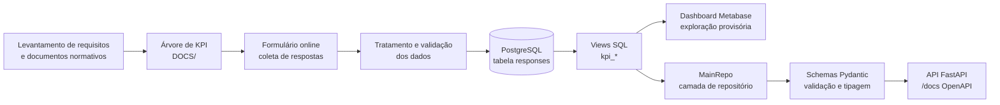

# Tá Na Mesa — Pipeline de Monitoramento da Política Pública (PB)

Pipeline de dados para monitorar a operacionalização do programa "Tá Na Mesa", política pública estadual de segurança alimentar que atende a todo o estado da Paraíba, desde a coleta de respostas de beneficiários até a disponibilização de indicadores (KPIs) via API.


## Sumário

- [Contexto e objetivo](#contexto-e-objetivo)
- [Visão geral da arquitetura / pipeline](#visão-geral-da-arquitetura--pipeline)
- [Estrutura de pastas](#estrutura-de-pastas)
- [Árvore de KPI](#árvore-de-kpi)
- [Stack tecnológica](#stack-tecnológica)
- [Como rodar o projeto localmente](#como-rodar-o-projeto-localmente)
- [Documentação da API](#documentação-da-api)
- [Dashboard (Metabase)](#dashboard-metabase)
- [Dados](#dados)
- [Equipe e governança](#equipe-e-governança)
- [Roadmap / próximos passos](#roadmap--próximos-passos)
- [Licença e contato](#licença-e-contato)

## Contexto e objetivo

O programa Tá Na Mesa oferece refeições subsidiadas a beneficiários em situação de vulnerabilidade alimentar em restaurantes credenciados em todo o estado da Paraíba. Este pipeline existe para responder, com dados, se a política está sendo operacionalizada como planejado: se o programa atinge o público-alvo correto, se o acesso aos restaurantes é equânime, se a execução operacional segue os padrões definidos em edital, se a qualidade das refeições é adequada e se há participação efetiva dos beneficiários na governança do programa.

O programa atende mais de 100 cidades e serve mais de 800.000 refeições mensalmente. É de enorme impacto e seu correto funcionamento é extremamente importante.

**O público do pipeline é primariamente:**

- **Gestores da política pública**, que precisam acompanhar indicadores de desempenho para tomada de decisão.
- **Equipe interdisciplinar** (nutricionistas e assistentes sociais), que validam hipóteses sobre a operacionalização do programa.
- **Beneficiários**, de forma indireta, como público impactado pelas melhorias identificadas a partir do monitoramento.

O ponto de partida analítico foi o levantamento de hipóteses sobre o funcionamento do programa — organizadas em seis eixos (Perfil dos beneficiários, Acesso e Equidade, Execução Operacional, Qualidade da Refeição, Participação e Governança, Legitimidade Social do Programa) — que orientaram tanto o desenho do formulário de coleta quanto a Árvore de KPI usada para validar ou refutar essas hipóteses.

Uma série de reuniões de alinhamento foram executadas ao longo de 3 meses de planejamento, onde indicadores e insights potencialmente relevantes, bem como a forma ideal de obtê-los, foram discutidos.

## Visão geral da arquitetura / pipeline

O pipeline segue seis etapas, do levantamento de requisitos até a disponibilização final dos dados:

1. **Levantamento de requisitos e contexto** — reuniões com gerência e equipe interdisciplinar (nutricionistas e assistentes sociais) e análise de documentos normativos, incluindo o edital de credenciamento dos restaurantes participantes.
2. **Modelagem analítica (Árvore de KPI)** — estruturação hierárquica das hipóteses e dos indicadores que as testam, documentada em `DOCS/` (ver seção [Árvore de KPI](#árvore-de-kpi)).
3. **Coleta de dados** — formulário online disponibilizado via QR-Code respondido por beneficiários em todo o território da Paraíba, com 41 perguntas cobrindo perfil socioeconômico, frequência de acesso, qualidade da refeição, infraestrutura do restaurante e satisfação em relação ao programa.
4. **Tratamento e persistência** — limpeza, padronização e validação das respostas, persistidas em banco **PostgreSQL**.
5. **Disponibilização intermediária (Metabase)** — dashboard exploratório provisório para verificação dos dados antes da disponibilização definitiva.
6. **Disponibilização final (API)** — camada de acesso tipada construída com **FastAPI**, que expõe os KPIs calculados via *views* SQL, através de uma camada de repositório, schemas Pydantic, uma camada service e suas rotas.




## Estrutura de pastas

```
ta-na-mesa-pipeline/
├── api/                          # Camada da aplicação FastAPI
│   ├── app.py                    # Configuração principal da aplicação
│   ├── config.py                 # Configurações de ambiente e variáveis
│   ├── db_settings.py            # Configuração do banco de dados e aplicação de views
│   ├── db_ingestion.py           # Script de ingestão de dados CSV para PostgreSQL
│   ├── deps.py                   # Dependências de injeção do FastAPI
│   ├── repos/                    # Camada de repositório (acesso aos dados)
│   │   ├── __init__.py
│   │   └── main_repo.py          # MainRepo com consultas às views SQL
│   ├── routes/                   # Camada de rotas HTTP
│   │   ├── __init__.py
│   │   └── main_router.py        # Router principal com endpoints /data/*
│   ├── schemas/                  # Schemas Pydantic para validação e tipagem
│   │   ├── __init__.py
│   │   ├── application_schema.py
│   │   ├── socioechonomics_schema.py
│   │   ├── restaurants_schema.py
│   │   └── programReview_schema.py
│   └── services/                 # Camada de serviço (lógica de negócio)
│       ├── __init__.py
│       └── main_service.py       # MainService que orquestra o MainRepo
├── db/                           # Banco de dados e scripts SQL
│   ├── init/                     # Scripts de inicialização do banco
│   │   └── init.sql
│   └── sql/                      # Views SQL para cálculo de KPIs
│       └── views.sql             # 20+ views SQL para cálculo de indicadores
├── data/                         # Diretório para dados brutos (CSV)
├── docs/                         # Documentação analítica
│   └── Árvore_de_indicadores.pdf # Documento com especificação dos 32 KPIs
├── notebooks/                    # Notebooks para análise exploratória
├── assets/                       # Arquivos estáticos
├── docker-compose.yml            # Orquestração de containers (db, api, pgadmin)
├── dockerfile                     # Imagem Docker da API
├── pyproject.toml                # Dependências Python (Poetry)
├── poetry.lock                   # Lock file das dependências
└── README.md                     # Esta documentação
```

## Árvore de KPI

A Árvore de KPI estrutura hierarquicamente as hipóteses sobre a operacionalização do programa e os indicadores que as testam. O nó raiz é "Desempenho do programa", que se ramifica em seis eixos principais: Perfil dos beneficiários, Acesso e Equidade, Execução Operacional, Qualidade da Refeição, Participação e Governança, e Legitimidade Social do Programa. Cada eixo agrupa hipóteses, e cada hipótese é testada por um ou mais KPIs (numerados de KPI 1 a KPI 32), cada um com nome, fórmula de cálculo (referenciando as perguntas do formulário, ex. Q5, Q6, Q11) e o sentido de leitura do indicador (se um valor maior ou menor representa melhor desempenho do programa).

Os indicadores foram refinados ao decorrer das reuniões interdisciplinares e posteriormente disponibilizados via API de dados e Dashboard Metabase para Insights de BI.

Todos os KPIs estão especificados no documento `Árvore_de_indicadores.pdf`, dentro de `docs/`, e cobrem desde frequência de acesso às refeições até qualidade percebida, infraestrutura do restaurante e satisfação do beneficiário. A implementação em *views* SQL desses KPIs restantes está em `db/sql/views.sql`

## Stack tecnológica

| Camada | Tecnologia | Versão |
|---|---|---|
| Linguagem | Python | >=3.13 |
| Gerenciamento de dependências | Poetry | >=2.0.0 |
| Banco de dados | PostgreSQL | 16-alpine |
| Acesso ao banco | SQLAlchemy | >=2.0.51,<3.0.0 |
| Driver PostgreSQL | psycopg2 | >=2.9.12,<3.0.0 |
| Validação e tipagem | Pydantic | (via FastAPI) |
| Framework web da API | FastAPI | >=0.139.0,<0.140.0 |
| Servidor ASGI | Uvicorn | >=0.51.0,<0.52.0 |
| Manipulação de dados | Pandas | >=3.0.3,<4.0.0 |
| Variáveis de ambiente | python-dotenv | >=1.2.2,<2.0.0 |
| Jupyter Notebook | ipykernel | >=7.3.0,<8.0.0 |
| Ferramenta de BI (exploratória) | Metabase | AWS EC2 |
| Interface administrativa DB | pgAdmin 4 | dpage/pgadmin4 |
| Orquestração | Docker Compose | - |


## Como rodar o projeto localmente

A API em si não pode ser disponibilizada com dados reais, em virtude da característica sensível dos dados coletados. Para desenvolvimento local, utilize dados sintéticos ou anonimizados.

### Pré-requisitos

- Docker e Docker Compose instalados
- Python 3.13+ (para desenvolvimento local sem Docker)
- Poetry (para gerenciamento de dependências)

### Variáveis de ambiente

Crie um arquivo `.env` na raiz do projeto com as seguintes variáveis:

```bash
# Banco de dados PostgreSQL
POSTGRES_USER=seu_usuario
POSTGRES_PASSWORD=sua_senha
DB_NAME=tanamesa_db
PG_DATA=/var/lib/postgresql/data
SQLALCHEMY_DATABASE_URL=postgresql://seu_usuario:sua_senha@db:5432/tanamesa_db

# pgAdmin 4
PGADMIN4_EMAIL=seu_email@example.com
PGADMIN4_PASSWORD=sua_senha_pgadmin

# Caminho para arquivo CSV de dados (para ingestão)
CSV_PATH=/app/data/responses.csv
```

### Subindo o banco e populando com dados

**Opção 1: Docker Compose (recomendado)**

```bash
# Suba todos os serviços (banco, API, pgAdmin)
docker-compose up -d

# Verifique os logs
docker-compose logs -f
```

**Opção 2: Apenas banco de dados local**

```bash
# Suba apenas o serviço do banco
docker-compose up -d db pgadmin
```

O banco estará disponível em `localhost:5432` e o pgAdmin em `http://localhost:5050`.

### Ingestão de dados

O processo de ingestão é realizado automaticamente pelo container da API ao iniciar (via `db_ingestion.py`). O script:

1. Aguarda 5 segundos para o banco estar pronto
2. Lê o arquivo CSV especificado em `CSV_PATH`
3. Cria a tabela `responses` com base no schema do CSV
4. Utiliza `COPY` do PostgreSQL para ingestão eficiente dos dados

Para ingestão manual:

```bash
# Dentro do container da API
docker exec -it tanamesa_api python api/db_ingestion.py
```

### Iniciando a API

**Com Docker Compose:**

```bash
docker-compose up -d api
```

A API estará disponível em `http://localhost:8000`.

**Desenvolvimento local (sem Docker):**

```bash
# Instale dependências
poetry install

# Ative o ambiente virtual
poetry shell

# Configure variáveis de ambiente
copy .env.example .env  # e edite conforme necessário

# Execute a aplicação
python -m uvicorn api.app:app --reload --host 0.0.0.0 --port 8000
```

### Verificação

```bash
# Health check
curl http://localhost:8000/healthy

# Documentação interativa OpenAPI/Swagger
# Acesse: http://localhost:8000/docs
```


## Documentação da API

A API segue uma arquitetura em camadas: **Routes** → **Service** → **Repository** → **Database**. A camada de acesso aos dados é a classe `MainRepo`, que centraliza as consultas às *views* SQL de KPI e retorna objetos Pydantic tipados. A documentação interativa OpenAPI/Swagger está disponível em `http://localhost:8000/docs`.

### Arquitetura da API

- **Routes** (`api/routes/main_router.py`): Define os endpoints HTTP e injeta dependências
- **Service** (`api/services/main_service.py`): Camada de lógica de negócio (atualmente um pass-through)
- **Repository** (`api/repos/main_repo.py`): Executa consultas SQL e retorna objetos tipados
- **Schemas** (`api/schemas/`): Define modelos Pydantic para validação e serialização

### Endpoints disponíveis

Todos os endpoints estão sob o prefixo `/data` e retornam status HTTP 200:

| Endpoint HTTP | Método Repository | Schema de retorno | Descrição |
|---|---|---|---|
| `GET /data/application/time` | `time_survey_application()` | `TimeSurveyApplicationResponse` | Tempo decorrido desde a primeira submissão (dias/semanas) e distribuição de submissões por dia e por semana |
| `GET /data/application/cities` | `submissions_by_city()` | `SubmissionsByCityResponse` | Contagem de submissões por cidade |
| `GET /data/socioechonomics/main-stats` | `beneficiaries_socioechonomics_stats()` | `BeneficiariesSocioeconomicsStats` | Beneficiários em vulnerabilidade alimentar grave, inscritos no CadÚnico e interseção |
| `GET /data/socioechonomics/access` | `consistency_of_access()` | `ConsistencyOfAccessResponse` | Frequência de acesso às refeições, segmentada por situação de vulnerabilidade |
| `GET /data/socioechonomics/dependency` | `program_dependency()` | `ProgramDependencyResponse` | Grau de dependência do programa, segmentado por situação de vulnerabilidade |
| `GET /data/socioechonomics/assisted-families` | `assisted_families()` | `AssistedFamiliesResponse` | Situação de atendimento das residências e configuração familiar dos atendidos |
| `GET /data/socioechonomics/local-access` | `local_access()` | `LocalAccessResponse` | Dificuldade de acesso ao restaurante, por região (urbana/rural) |
| `GET /data/socioechonomics/not-eating` | `beneficiaries_not_eating()` | `BeneficiariesNotEatingStats` | Beneficiários que aguardaram na fila e não receberam refeição |
| `GET /data/restaurants/queue-time` | `time_on_queue()` | `TimeOnQueueResponse` | Distribuição do tempo de espera na fila e tempo médio de espera |
| `GET /data/restaurants/menu` | `restaurant_menu_stats()` | `RestaurantMenuStats` | Percepção sobre variedade, repetição e satisfação com o cardápio |
| `GET /data/restaurants/infrastructure` | `restaurant_infrastructure_stats()` | `RestaurantInfrastructureStats` | Sinalização, limpeza, integridade da embalagem/alimento e separação entre pagamento e entrega |
| `GET /data/program/review` | `program_review_stats()` | `ProgramReviewStats` | Avaliação da quantidade de comida, proteína, sabor e continuidade do programa |

### Endpoint de health check

- `GET /healthy`: Retorna `{"status": "healthy"}` para verificação da operacionalidade da API

### Inicialização de views SQL

Ao iniciar, a API executa automaticamente o método `apply_sql_views()` que aplica todas as views SQL definidas em `db/sql/views.sql` ao banco de dados. Isso garante que as views de KPI estejam sempre atualizadas com a estrutura mais recente.

## Dashboard (Metabase)

O dashboard em Metabase foi utilizado para verificação exploratória dos dados antes da disponibilização definitiva via API — permitindo à equipe identificar insights nos dados já tratados e nortear decisões de BI de maneira antecipada. Além de compor relatórios técnicos enviados à Secretaria de Desenvolvimento Humano do Estado da Paraíba.

Os dados tratados estão hospedados em um PostgreSQL na plataforma Retool, que é de onde o Metabase, hospedado em um EC2 AWS, faz suas requisições e monta as visualizações de dados.

Por favor, acesse em:
[http://54.227.203.188:3000/public/dashboard/a5e20887-fad9-4ea9-8da6-2a326ac913cf](Metabase AWS EC2 hosted)

## Dados

### Origem

Respostas de beneficiários coletadas por um formulário online, aplicado em todo o território da Paraíba, com 41 perguntas cobrindo:
- Inscrição no CadÚnico
- Condição de trabalho e renda
- Composição familiar
- Segurança alimentar (escala VAG - Vulnerabilidade Alimentar Grave)
- Frequência de acesso às refeições
- Sinalização e limpeza do restaurante
- Tempo de espera na fila
- Qualidade e variedade do cardápio
- Satisfação com o programa

### Processamento e ingestão

O pipeline de ingestão de dados é implementado em `api/db_ingestion.py`:

1. **Leitura do CSV**: Utiliza Pandas para ler o arquivo especificado em `CSV_PATH`
2. **Criação da tabela**: Cria a tabela `responses` no PostgreSQL com base no schema do CSV
3. **Ingestão eficiente**: Utiliza o comando `COPY` do PostgreSQL para ingestão em massa, que é significativamente mais eficiente que inserts individuais
4. **Persistência**: Os dados são persistidos na tabela `responses` com todas as colunas do formulário

### Persistência

Banco de dados PostgreSQL com:
- **Tabela principal**: `responses` - contém todas as respostas do formulário com as colunas originais (ex: `"Submitted at"`, `"Selecione o seu município"`, `"Você é inscrito no programa CadÚnico?"`, etc.)
- **Views de KPI**: 20+ views SQL com prefixo `kpi_` que pré-calculam os indicadores

### Camada analítica (Views SQL)

Os KPIs não são calculados diretamente sobre a tabela de respostas a cada requisição. São pré-calculados por meio de *views* SQL nomeadas com o prefixo `kpi_`, implementadas em `db/sql/views.sql`:

**Views de administração da pesquisa:**
- `kpi_time_survey_administration_summary` - Tempo decorrido desde a primeira submissão
- `kpi_submissions_by_day` - Distribuição de submissões por dia
- `kpi_submissions_by_week` - Distribuição de submissões por semana
- `kpi_submissions_by_city` - Contagem de submissões por cidade

**Views socioeconômicas:**
- `kpi_beneficiaries_socioechonomics_stats` - Estatísticas de vulnerabilidade e CadÚnico
- `kpi_consistency_of_access` - Consistência de acesso por vulnerabilidade
- `kpi_program_dependency` - Dependência do programa por vulnerabilidade
- `kpi_residence_program_serving` - Atendimento das residências
- `kpi_entire_served_family_configuration` - Configuração familiar
- `kpi_difficulty_of_access_by_region` - Dificuldade de acesso por região
- `kpi_beneficiaries_not_eating_stats` - Beneficiários que não receberam refeição

**Views de restaurantes:**
- `kpi_time_on_queue_stats` - Distribuição do tempo na fila
- `kpi_average_time_on_queue` - Tempo médio na fila
- `kpi_restaurant_menu_summary` - Estatísticas do cardápio
- `kpi_restaurant_infrastructure_summary` - Estatísticas de infraestrutura

**Views de avaliação do programa:**
- `kpi_program_evaluation_summary` - Avaliação geral do programa

As views são aplicadas automaticamente ao iniciar a API através do método `apply_sql_views()` em `api/db_settings.py`.

## Equipe e governança

O desenho analítico do pipeline (hipóteses, árvore de KPI, formulário) foi construído em conjunto com uma equipe interdisciplinar composta por nutricionistas e assistentes sociais, responsável por validar as hipóteses sobre a operacionalização do programa a partir de sua expertise técnica. O responsável técnico do pipeline conduziu o levantamento de requisitos, a modelagem analítica e a implementação da coleta, tratamento, persistência e disponibilização dos dados.

**Contato técnico:** carlos.rocha@ufpi.edu.br

## Licença

Este projeto está sob licença MIT. Para mais informações, consulte o arquivo LICENSE.

## Roadmap / próximos passos

- [ ] Implementar tratamento de dados e validação de respostas no pipeline de ingestão
- [ ] Adicionar testes automatizados para a API e views SQL
- [ ] Implementar autenticação e autorização na API
- [ ] Adicionar documentação do schema completo da tabela `responses`
- [ ] Implementar sistema de agendamento para ingestão periódica de dados
- [ ] Adicionar monitoramento e alertas para a operacionalização da API
- [ ] Expandir dashboard Metabase com mais visualizações interativas
- [ ] Implementar versão oficial da licença no arquivo LICENSE
